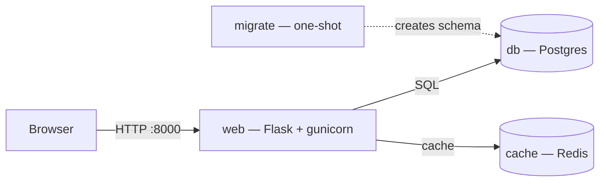

# Docker, Hands-On — A Refresher Course (with a Real App)

A practical, build-it-as-you-go Docker course that takes you from a single container to a self-healing Kubernetes deployment — taught through **one real application** that grows module by module: a Flask API backed by Postgres and Redis.

Every concept is introduced because the running app *needs* it. No isolated toy examples; the same app you containerize in Module 2 is the app you deploy to Kubernetes in Module 10.

> **Built for:** developers who've used Docker before and want a structured refresher that goes from basics to Compose to Kubernetes — hands-on, terminal-first, macOS + Docker Desktop.

---

## What's in here

This repo is two things at once:

1. **A runnable example app** — a Flask service that records visits in Postgres and counts hits in Redis. It's the thread the whole course is woven around.
2. **A 10-module course** (`/course`) that builds that app up from scratch, each module a self-contained, hands-on chapter.

```
.
├── app.py                 # the Flask app (Postgres + Redis backed)
├── migrate.py             # one-shot schema migration
├── requirements.txt       # Python deps (flask, gunicorn, psycopg2, redis)
├── Dockerfile             # multi-stage, non-root, healthchecked image
├── .dockerignore
├── compose.yaml           # the full stack: web + db + cache (+ migrate)
├── compose.override.yaml  # dev-only tweaks (hot reload, watch) — auto-merged
├── compose.prod.yaml      # production-style overrides (explicit -f)
├── .env                   # local config & ports (gitignored in real use)
├── secrets/               # file-based secrets (gitignored)
│   └── db_password.txt
├── k8s-stack.yaml         # the same app as Kubernetes manifests
└── course/                # the course itself
    ├── docker-course-MODULE-TEMPLATE.md
    └── docker-course-module-01.md … module-10.md
```

---

## The application

A three-tier app, deliberately small so the infrastructure stays the star:



- **web** — Flask app served by gunicorn. On each request it inserts a row in Postgres (durable visit log) and increments a Redis counter (volatile), returning both.
- **db** — Postgres 16, data persisted to a named volume so it survives container removal.
- **cache** — Redis 7, intentionally volume-less to contrast durable vs. ephemeral state.
- **migrate** — a one-shot container that creates the schema once, before `web` starts.

---

## Prerequisites

- **macOS** with **[Docker Desktop](https://www.docker.com/products/docker-desktop/)** running (the course is written for this environment; Mac-specific notes are called out throughout).
- For the Kubernetes module: enable Kubernetes in **Docker Desktop → Settings → Kubernetes**.
- That's it — you do **not** need Python, Postgres, or Redis installed on your Mac. That's the whole point.

Verify Docker is up:

```bash
docker version    # should show both Client and Server sections
```

---

## Quick start

Bring the entire stack up with one command:

```bash
docker compose up -d --build
```

Then hit it (note the port — see the macOS note below):

```bash
curl localhost:8000
# host=… db_visits=1 redis_hits=1
curl localhost:8000
# host=… db_visits=2 redis_hits=2
```

Tear it down (your database volume is kept):

```bash
docker compose down
```

> **macOS port note:** the app publishes on host port **8000** (`8000:5000`), not 5000, because macOS's AirPlay Receiver occupies port 5000. If you change this, mind that conflict.

---

## Running it three ways

The app is designed to run identically across all the orchestration approaches the course teaches.

### 1. Docker Compose (recommended)

```bash
docker compose up -d --build         # start everything
docker compose ps                    # see the services
docker compose logs -f web           # follow web's logs
docker compose exec web sh           # shell into the web service
docker compose down                  # stop (volumes kept)
docker compose down -v               # ⚠️ stop AND delete the database volume
```

Development mode (hot reload via `compose.override.yaml`, auto-merged):

```bash
docker compose up --watch            # edits to app.py sync & reload instantly
```

Production-style run (explicit override, no reload, multiple workers):

```bash
docker compose -f compose.yaml -f compose.prod.yaml up -d
```

### 2. Manual containers (the "by hand" way, for understanding)

```bash
docker network create appnet
docker run -d --name pg --network appnet \
  -e POSTGRES_PASSWORD=secret -e POSTGRES_DB=appdb \
  -v pgdata:/var/lib/postgresql/data postgres:16
docker run -d --name redis --network appnet redis:7-alpine
docker build -t flask-app:0.4 .
docker run -d --name web --network appnet -p 8000:5000 \
  -e DB_HOST=pg -e REDIS_HOST=redis flask-app:0.4
curl localhost:8000
```

### 3. Kubernetes (Docker Desktop's built-in cluster)

```bash
# enable Kubernetes in Docker Desktop settings first, then:
docker build -t flask-app:0.4 .
kubectl apply -f k8s-stack.yaml
kubectl get pods
kubectl port-forward service/web 8000:5000
curl localhost:8000
```

---

## Configuration

The app reads its configuration from environment variables (set in `compose.yaml` / `.env`):

| Variable | Purpose | Default in `app.py` |
|---|---|---|
| `DB_HOST` | Postgres hostname (a service/container name) | `pg` |
| `REDIS_HOST` | Redis hostname | `redis` |
| `DB_PASS` | Postgres password | — |
| `POSTGRES_PASSWORD` | Postgres superuser password (read by the DB) | — |
| `POSTGRES_DB` | Database name | — |
| `WEB_PORT` | Host port to publish web on | `8000` |

In Compose, services address each other by **service name**, so `compose.yaml` sets `DB_HOST=db` and `REDIS_HOST=cache` (the service names), overriding the code defaults.

Sensitive values can be supplied as **file-based secrets** (see `secrets/` and the `secrets:` block in `compose.yaml`) rather than plain environment variables. Add `secrets/` and `.env` to your `.gitignore` — they're not meant for version control.

---

## Handy commands

```bash
# Images & build
docker build -t flask-app:0.4 .          # build the app image
docker images flask-app                  # see size
docker history flask-app:0.4             # see layers

# Inspect a running stack
docker compose ps
docker stats --no-stream                 # CPU / memory per container
docker inspect --format '{{.State.Health.Status}}' <container>

# Cleanup
docker system df                         # what's reclaimable
docker system prune                      # containers, networks, dangling images, build cache
#   (avoid --volumes unless you intend to delete the database)
```

---

## Troubleshooting

**`could not translate host name "pg" to address`**
You ran `web` without a reachable Postgres on the same network. Run the full stack with `docker compose up` (which provides `db` and the network), or use the manual setup above with a `pg` container on `appnet`. See *Module 5* and *Module 9*.

**`curl localhost:8000` connection refused, or you reach AirPlay instead**
macOS occupies port 5000; this project publishes on **8000**. If you remapped it, avoid 5000 or disable AirPlay Receiver in System Settings.

**Container reports `(unhealthy)` though the app works**
The image's `HEALTHCHECK` uses Python (not `curl`, which isn't in the slim base). If you point a healthcheck at `/`, it depends on Postgres being reachable — use a dependency-free `/health` route for liveness instead. See *Module 7* and *Module 10*.

**`exec format error` when deploying to a cloud server**
You built an `arm64` image on Apple Silicon and ran it on `amd64`. Rebuild multi-arch:
```bash
docker buildx build --platform linux/amd64,linux/arm64 -t <user>/flask-app:0.4 --push .
```

**"No space left on device" during a build**
That's Docker Desktop's VM disk, not your Mac's. Run `docker system df` then `docker system prune`. See *Module 1* and *Module 9*.

---

## The course

Ten modules, each hands-on and self-contained. They build on each other — and earlier commands deliberately reappear in later modules to cement them through repetition.

| # | Module | You'll learn |
|---|--------|--------------|
| 1 | Containers & Images | `run`, `ps`, `logs`, `exec`, `inspect`, `stats`, lifecycle, cleanup |
| 2 | Building Images with Dockerfiles | `FROM`/`COPY`/`RUN`, `CMD` vs `ENTRYPOINT`, layer caching, `.dockerignore` |
| 3 | Image Optimization | slim/alpine bases, multi-stage builds, cache mounts, non-root, `dive` |
| 4 | Volumes & Persistent Data | named volumes vs bind mounts, backups, the macOS storage reality |
| 5 | Networking | user-defined networks, name-based DNS, publish vs expose |
| 6 | Compose Fundamentals | `compose.yaml`, `up`/`down`, `.env`, the auto-network |
| 7 | Compose Deep Dive I | healthchecks, `develop.watch`, profiles, scaling, dev/prod overrides |
| 8 | Compose Deep Dive II | migrations, YAML anchors, secrets, configs, resource limits |
| 9 | Debugging & Troubleshooting | a systematic playbook, exit codes, `netshoot`, broken-stack drills |
| 10 | Ops & Kubernetes Intro | restart policies, registries, scanning, deploying to Kubernetes |

Start at [`course/docker-course-module-01.md`](course/docker-course-module-01.md).

---

## License

MIT — see `LICENSE`. Use it, fork it, teach from it.

---

*Built as a hands-on Docker refresher. The deeper goal isn't memorizing commands — it's understanding why each layer of the stack exists, by hitting the wall that made the next tool necessary.*
